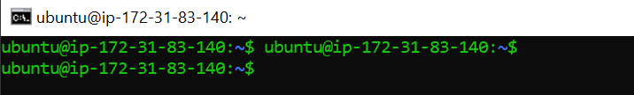
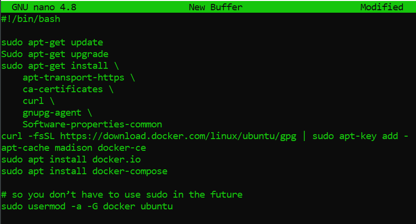
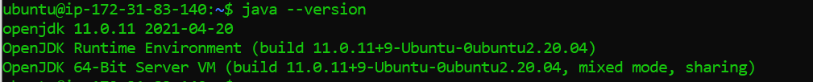

# Deployment 7

## [AWS EC2](https://aws.amazon.com/ec2/?ec2-whats-new.sort-by=item.additionalFields.postDateTime&ec2-whats-new.sort-order=desc) Set up

1. Created a EC2 with a ubuntu ami on aws. 

2. ssh into EC2



3. Install docker onto EC2:

  * Make a bash file
 ```
 $ nano docker_install.sh 
```

  * Copy and paste the code below in the [bash file](https://github.com/ibrahima1289/deploy7/blob/main/docker_install.sh) linked in this repo.
  
  

4. Make the bash file executable
  ```
  Sudo chmod +x docker_install.sh
  ```
5. Make sure you are in the directory where the bash file is before you run the bash file.<br>
  Otherwise, specify the path where the bash file is.
  
  ```
  $ ./docker-install.sh
  ```

6. Exit and ssh back in.

7. Make sure you have Java installed (we used version 11): run the command below:
```
$ apt install openjdk-11-jre-headless
```

 
 
 

## [AWS ECS](https://aws.amazon.com/ecs/) Set up


## Pipeline script

1. Create a [github](https://docs.github.com/en/get-started/quickstart/create-a-repo) repo.

2. Create [Jenkinsfile](https://github.com/ibrahima1289/deploy7/blob/main/Jenkinsfile) on that github repo.<br>
Paste the code from the [pdf](https://github.com/ibrahima1289/DEPLOY07_ECS/blob/main/Deployment%237%20(1).pdf) into the jenkinsfile.

3. Create a [Dockerfile](https://github.com/ibrahima1289/deploy7/blob/main/Dockerfile) on your github that has the instruction to create a Java application.

4. Add the jar file to the repo.


# Sources visited:

https://hub.docker.com/r/jenkins/jenkins<br>
https://dev.to/kamalhossain/how-to-run-docker-containers-in-aws-ec2-3bh0<br>
https://medium.com/@asepmaulanaismail/simple-shortcut-to-install-docker-in-ubuntu-using-shell-script-59cc9e89b47a<br>

